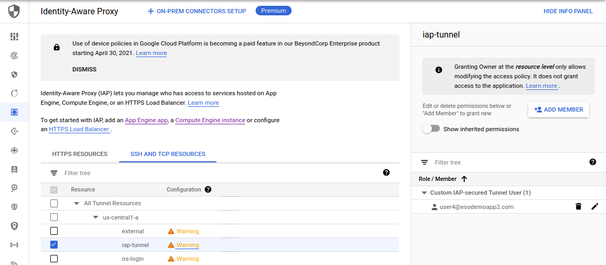
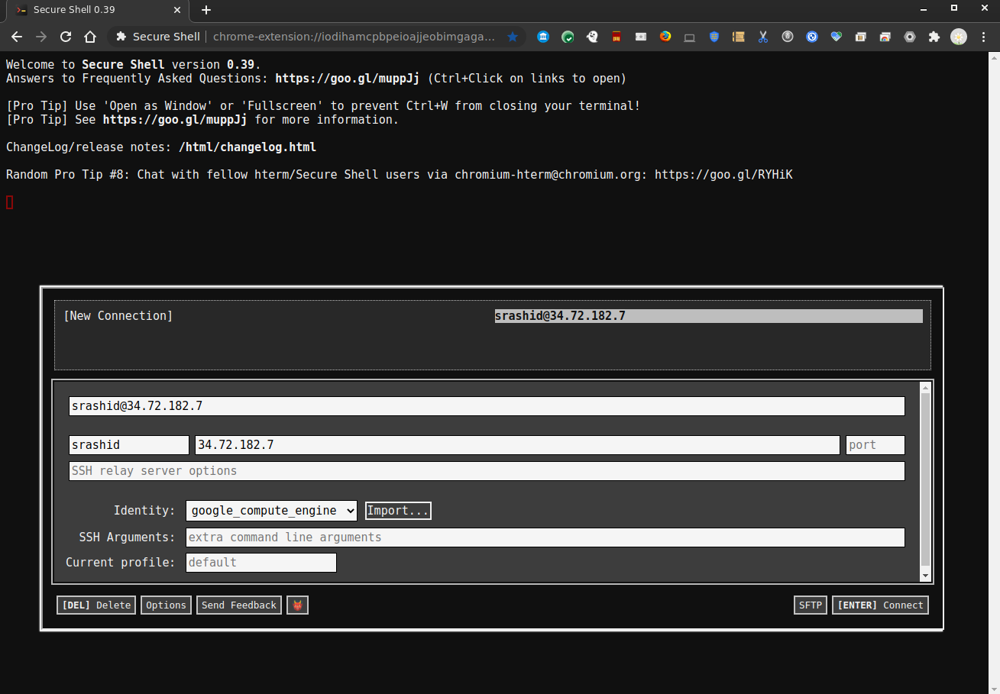

## Google Cloud SSH Troubleshooter

CLI application to help diagnose SSH access issues on Google Cloud.

This script uses various GCP APIs to help narrow down issues a user may see while trying to SSH to a VM from your desktop.

NOTE: this script does not require admin access: it use various GCP APIs a user is expected to already have while trying to SSH to a VM.  If a specific IAM permission set or connectivity issue is determined, the script will suggest remediation steps.

>> This script is **NOT** supported by Google Cloud

### Limitations

I wrote this script in a day and change so there are a lot of these:

* Project level keys are not cross verified before SSH is run (since the script will not have access to project-ssh public keys)
* Org-level OS login constraints have not been tested (the script detects OS-login by looking at the VM-metadata; i'm not sure if the org-level constraints uses metadata..if it does, it should also work)

---

The various types of VMs this script accounts for:

1. VM with External IP
2. VM with OS-Login
3. VM with IAP-SSH Tunnel

In each case the sequence of tests include:

1. Acquire the current users gcloud CLI credentials (not Application Default Credentials)
2. As the current user, attempt to read the target VM's metadata
   - GCE requires VM Read Permissions at a minimum
   - Read VM's ServiceAccount (if present), ExternalIP (if present), SSHPublic Keys (if available), OS Login Status ((if present))
3. If external IP is present, attempt to connect to external address on port `:22`
   - if connectivity failed, optionally run traceroute and display output
4. Acquire host project for the VM
   - GCE requires `compute.projects.get`
   - Check if user has IAM Permissions: `compute.projects.setCommonInstanceMetadata` to allow Project-Level SSH Keys
5. Acquire VM's SerivceAccount
   - Check if user has required `iam.serviceAccounts.get`, `iam.serviceAccounts.actAs` Permissions.  
6. Optionally verify IAP SSH Tunnel is enabled
   - Check if user has `iap.tunnelInstances.accessViaIAP` permissions on the GCE Resource
7. Verify the SSH private keys match the public keys as saved in Instance Metadata only (Project Keys are not visible)
8. If you made it this far, you should be ok.
   - attempt to SSH in using the ssh keys provided iff the VM is external or external with OS-login w/o 2FA

also see [Troubleshooting SSH](https://cloud.google.com/compute/docs/troubleshooting/troubleshooting-ssh)

---

### Setup

Requires 
* golang `1.14+`  (you can run the prebuilt binaries if you want)
* gcloud cli

### Usage

In following sample demonstrates usage on three VM types:

* `external`:  VM with external IP
* `os-login`:  VM with external IP and OS-Login
* `iap-tunnel`:  VM with internal only IP

All three VMs run as serviceAccount=`248066739582-compute@developer.gserviceaccount.com`


First setup some env-vars

```bash
export TOKEN=`gcloud auth print-access-token`
export PROJECT_ID=`gcloud config get-value core/project`
export ZONE=`gcloud config get-value compute/zone`

# the following reflect the values displayed in the project i used
export SSH_USERNAME=user4@esodemoap2.com
export VM_SERVICE_ACCOUNT=248066739582-compute@developer.gserviceaccount.com
```

### External

Assume you want to ssh like the following

```
gcloud compute ssh external --project $PROJECT_ID --zone us-central1-a
```

#### A) No VM Permissions

If you do not have permissions to view the VM, you'll see the CLI state as much

```log
$ go run main.go --access_token=$TOKEN --instance external --project $PROJECT_ID --zone $ZONE -v 20 -alsologtostderr
    I0201 07:07:28.015263 3548861 main.go:385] ========  Starting Troubleshooter ========
    I0201 07:07:28.015442 3548861 main.go:397] ========  User srashid
    I0201 07:07:28.251095 3548861 main.go:425]     Running tests for [user4@esodemoapp2.com]
    I0201 07:07:28.251147 3548861 main.go:99]      Getting instance [external] in project,zone: [fabled-ray-104117,us-central1-a]
    E0201 07:07:28.570434 3548861 main.go:108]       ERROR:  user does not have [compute.instances.get] permission on VM: [external]
    E0201 07:07:28.572418 3548861 main.go:428] InstanceID not Found using GCE API googleapi: Error 403: Required 'compute.instances.get' permission for 'projects/fabled-ray-104117/zones/us-central1-a/instances/external', forbidden
    exit status 255
```

To fix, an admin for the project/vm should grant you a role with the minimum permissions shown below

Note, the permission set is included in many other roles.

Specifically note `compute.instances.setMetadata`.  This permission allows a user to set "instance-level" SSH key


In our case, the admin would run 
```bash
$ more ssh_login_role.yaml 
title: sshLoginRole
description: Role to grant SSH OS Login
stage: ALPHA
includedPermissions:
- compute.instances.setMetadata
- compute.instances.use
- compute.instances.get

gcloud iam roles create SSHRole --project $PROJECT_ID --file=ssh_login_role.yaml

gcloud compute instances add-iam-policy-binding external --member='user:$SSH_USERNAME'  \
   --role='projects/$PROJECT_ID/roles/SSHRole'
```


#### B) No Project Permissions

If you rerun the script, you may see it halt if the current user does not have project permissions

```log
    $ go run main.go --access_token=$TOKEN --instance external --project $PROJECT_ID --zone $ZONE -v 20 -alsologtostderr
    I0201 07:14:32.242030 3550165 main.go:385] ========  Starting Troubleshooter ========
    I0201 07:14:32.242176 3550165 main.go:397] ========  User srashid
    I0201 07:14:32.425471 3550165 main.go:425]     Running tests for [user4@esodemoapp2.com]
    I0201 07:14:32.425584 3550165 main.go:99]      Getting instance [external] in project,zone: [fabled-ray-104117,us-central1-a]
    I0201 07:14:32.803873 3550165 main.go:113]       Found  VM instanceID "4723343781070075848"
    I0201 07:14:32.803947 3550165 main.go:118]       Found  VM ServiceAccount "248066739582-compute@developer.gserviceaccount.com"
    I0201 07:14:32.803979 3550165 main.go:126]       VM does not have external IP
    I0201 07:14:32.804005 3550165 main.go:141]       Found Instance OSLogin TRUE
    I0201 07:14:32.804041 3550165 main.go:154]       Testing IAM Permissions [compute.instances.setMetadata compute.instances.use compute.instances.osLogin]
    I0201 07:14:33.030390 3550165 main.go:159]       Error getting IAM Permissions on VM: googleapi: Error 403: Required 'compute.instances.list' permission for 'projects/fabled-ray-104117', forbidden
```

Again, as the admin, grant the user the [compute.viewer](https://cloud.google.com/compute/docs/access/iam#compute.viewer)

```bash
gcloud projects add-iam-policy-binding $PROJECT_ID  \
   --member=user:$SSH_USERNAME    --role=roles/compute.viewer
```

#### C) Network Firewall

Rerunning this script may show a "Dial" error (i.,e cannot connect to the external IP)

This indicates some network issue from the origin to google or a firewall rule on the GCP Project.

> Note, this test isn't applicable much for IAP-tunnel enabled VMs

```log
$ go run main.go --access_token=$TOKEN --instance external --project $PROJECT_ID --zone $ZONE -v 20 -alsologtostderr
    I0201 07:29:22.330927 3552876 main.go:387] ========  Starting Troubleshooter ========
    I0201 07:29:22.331082 3552876 main.go:399] ========  User srashid
    I0201 07:29:22.560318 3552876 main.go:427]     Running tests for [user4@esodemoapp2.com]
    I0201 07:29:22.560380 3552876 main.go:99]      Getting instance [external] in project,zone: [fabled-ray-104117,us-central1-a]
    I0201 07:29:22.848661 3552876 main.go:113]       Found  VM instanceID "4723343781070075848"
    I0201 07:29:22.848715 3552876 main.go:118]       Found  VM ServiceAccount "248066739582-compute@developer.gserviceaccount.com"
    I0201 07:29:22.848743 3552876 main.go:128]       Found Registered External IP Address: 35.232.63.45
    I0201 07:29:22.848775 3552876 main.go:154]       Testing IAM Permissions [compute.instances.setMetadata compute.instances.use]
    I0201 07:29:23.016244 3552876 main.go:165]       Verified IAM Permissions [compute.instances.setMetadata compute.instances.use]
    I0201 07:29:23.016304 3552876 main.go:434]     VM Has External IP [35.232.63.45], starting networking connectivity tests
    I0201 07:29:23.016329 3552876 main.go:267]      Checking network connectivity using Dial: [35.232.63.45:22]
    E0201 07:29:38.259243 3552876 main.go:274]      Could not Dial.  Check if Firewall rules allow ort 22 connectivity to VM.   Error: [dial tcp 35.232.63.45:22: connect: connection timed out]
```

If you want, rerun the above test with  the `--enableTraceRoute` flag:

```log
$ sudo go run main.go --access_token=$TOKEN --instance external --project $PROJECT_ID --zone $ZONE --enableTraceRoute -v 20 -alsologtostderr
    I0201 07:35:16.607762 3553446 main.go:387] ========  Starting Troubleshooter ========
    I0201 07:35:16.607994 3553446 main.go:399] ========  User root
    I0201 07:35:16.831790 3553446 main.go:427]     Running tests for [user4@esodemoapp2.com]
    I0201 07:35:16.831887 3553446 main.go:99]      Getting instance [external] in project,zone: [fabled-ray-104117,us-central1-a]
    I0201 07:35:17.119570 3553446 main.go:113]       Found  VM instanceID "4723343781070075848"
    I0201 07:35:17.119635 3553446 main.go:118]       Found  VM ServiceAccount "248066739582-compute@developer.gserviceaccount.com"
    I0201 07:35:17.119677 3553446 main.go:128]       Found Registered External IP Address: 35.232.63.45
    I0201 07:35:17.119708 3553446 main.go:154]       Testing IAM Permissions [compute.instances.setMetadata compute.instances.use]
    I0201 07:35:17.285986 3553446 main.go:165]       Verified IAM Permissions [compute.instances.setMetadata compute.instances.use]
    I0201 07:35:17.286050 3553446 main.go:434]     VM Has External IP [35.232.63.45], starting networking connectivity tests
    I0201 07:35:17.286074 3553446 main.go:267]      Checking network connectivity using Dial: [35.232.63.45:22]
    E0201 07:35:32.563205 3553446 main.go:274]      Could not Dial.  Check if Firewall rules allow ort 22 connectivity to VM.   Error: [dial tcp 35.232.63.45:22: connect: connection timed out]
    I0201 07:35:32.564449 3553446 main.go:277]      Running traceRoute with timeout 100
    I0201 07:36:04.401654 3553446 main.go:290]       1   www.routerlogin.com. (192.168.1.1)  7.164324ms
    I0201 07:36:04.401730 3553446 main.go:290]       2   96.120.11.29 (96.120.11.29)  13.422233ms
    I0201 07:36:04.401758 3553446 main.go:290]       3   69.139.215.121 (69.139.215.121)  10.593878ms
    I0201 07:36:04.401780 3553446 main.go:290]       4   96.108.111.129 (96.108.111.129)  9.976522ms
    I0201 07:36:04.401801 3553446 main.go:290]       5   96.110.7.77 (96.110.7.77)  20.368249ms
    I0201 07:36:04.401822 3553446 main.go:290]       6   ae-16-ar01.capitolhghts.md.bad.comcast.net. (162.151.60.233)  12.301416ms
    I0201 07:36:04.401850 3553446 main.go:290]       7   68.85.133.137 (68.85.133.137)  17.151571ms
    I0201 07:36:04.401871 3553446 main.go:290]       8   be-31441-cs04.ashburn.va.ibone.comcast.net. (96.110.40.29)  19.302595ms
    I0201 07:36:04.401892 3553446 main.go:290]       9   be-2107-pe07.ashburn.va.ibone.comcast.net. (96.110.32.186)  21.482665ms
    I0201 07:36:04.401913 3553446 main.go:290]       10  50.208.232.110 (50.208.232.110)  25.910674ms
    I0201 07:36:04.401935 3553446 main.go:290]       11  108.170.246.33 (108.170.246.33)  15.845957ms
    I0201 07:36:04.401956 3553446 main.go:290]       12  108.170.246.49 (108.170.246.49)  13.96146ms
    I0201 07:36:04.401977 3553446 main.go:290]       13  142.251.49.162 (142.251.49.162)  15.990185ms
    I0201 07:36:04.401999 3553446 main.go:290]       14  142.251.49.91 (142.251.49.91)  38.260311ms
    I0201 07:36:04.402020 3553446 main.go:290]       15  142.250.232.126 (142.250.232.126)  50.132444ms
    I0201 07:36:04.402041 3553446 main.go:290]       16  142.250.231.46 (142.250.231.46)  62.252427ms
    I0201 07:36:04.402068 3553446 main.go:290]       17  209.85.142.117 (209.85.142.117)  48.227472ms
    I0201 07:36:04.402092 3553446 main.go:290]       18  142.250.232.67 (142.250.232.67)  55.755955ms
```

If the issue is on GCP with a firewall rule, ask your admin to allow the origin IP address access over port `:22` (ssh)

```bash
gcloud compute firewall-rules create allow-ssh-ingress \
        --direction=INGRESS        --action=allow     \
        --rules=tcp:22        --source-ranges=0.0.0.0/0 --project $PROJECT_ID
```

Note, the bit above will allow ssh from all origins! 

#### D) User cannot use VM's Service Account

If you've connected through and see an error about `iam.serviceAccounts.actAs`, that means you don't have permissions to 'use' the resident service account the VM runs as

```log
$ go run main.go --access_token=$TOKEN --instance external --project $PROJECT_ID --zone $ZONE -v 20 -alsologtostderr
    I0201 07:41:02.162925 3556112 main.go:391] ========  Starting Troubleshooter ========
    I0201 07:41:02.163078 3556112 main.go:403] ========  User srashid
    I0201 07:41:02.345770 3556112 main.go:431]     Running tests for [user4@esodemoapp2.com]
    I0201 07:41:02.345824 3556112 main.go:99]      Getting instance [external] in project,zone: [fabled-ray-104117,us-central1-a]
    I0201 07:41:03.168643 3556112 main.go:113]       Found  VM instanceID "4723343781070075848"
    I0201 07:41:03.168708 3556112 main.go:118]       Found  VM ServiceAccount "248066739582-compute@developer.gserviceaccount.com"
    I0201 07:41:03.168748 3556112 main.go:128]       Found Registered External IP Address: 35.232.63.45
    I0201 07:41:03.168779 3556112 main.go:154]       Testing IAM Permissions [compute.instances.setMetadata compute.instances.use]
    I0201 07:41:03.320462 3556112 main.go:165]       Verified IAM Permissions [compute.instances.setMetadata compute.instances.use]
    I0201 07:41:03.320529 3556112 main.go:438]     VM Has External IP [35.232.63.45], starting networking connectivity tests
    I0201 07:41:03.320552 3556112 main.go:271]      Checking network connectivity using Dial: [35.232.63.45:22]
    I0201 07:41:03.384051 3556112 main.go:298]     Network Connectivity Established 
    I0201 07:41:03.384115 3556112 main.go:237]     Reading project: [fabled-ray-104117]
    I0201 07:41:03.484025 3556112 main.go:249]      Found  ProjectID "fabled-ray-104117"
    I0201 07:41:03.484084 3556112 main.go:250]      Found  ProjectNumber 248066739582
    I0201 07:41:03.484110 3556112 main.go:251]      Found  State "ACTIVE"
    I0201 07:41:03.484132 3556112 main.go:252]      Found  Parent &cloudresourcemanager.ResourceId{Id:"673208786098", Type:"organization", ForceSendFields:[]string(nil), NullFields:[]string(nil)}
    I0201 07:41:03.484177 3556112 main.go:255]      Testing Project level metadata permissions 
    I0201 07:41:03.652990 3556112 main.go:265]      Testing Project level metadata permissions ---> []
    I0201 07:41:03.653042 3556112 main.go:172]     Reading Project, ServiceAccount: fabled-ray-104117, [248066739582-compute@developer.gserviceaccount.com]
    I0201 07:41:03.918427 3556112 main.go:189]      User has following permissions on serviceAccount []
    E0201 07:41:03.918483 3556112 main.go:191]       ERROR: Service account %v is missing iam.serviceAccounts.actAs permission248066739582-compute@developer.gserviceaccount.com
    E0201 07:41:03.919841 3556112 main.go:454] ERROR: Service account 248066739582-compute@developer.gserviceaccount.com is missing iam.serviceAccounts.actAs permission
```

To fix you your admin mus grant you the minimum permissions to use that SA:

One such grant is like this (there are several GCP native that allow this too)

```bash
$ cat sa_user_role.yaml 
title: saUserRole
description: Role to grant SSH SA User
stage: ALPHA
includedPermissions:
- iam.serviceAccounts.actAs

gcloud iam roles create SSHSAUserRole --project $PROJECT_ID --file=sa_user_role.yaml

gcloud iam service-accounts  add-iam-policy-binding $VM_SERVICE_ACCOUNT \
 --member='user:$SSH_USERNAME'  --role='projects/$PROJECT_ID/roles/SSHSAUserRole'
```


#### E) Verify Connectivity with gcloud

At this point, you should be able to use gcloud to ssh in. 

Note: the following did not update the project-wide metadata but instance

```bash
$ gcloud compute ssh external
Updating project ssh metadata...failed.                                                                                                                                                                                                                                                                                              
Updating instance ssh metadata...⠛
Updated [https://www.googleapis.com/compute/v1/projects/fabled-ray-104117/zones/us-central1-a/instances/external].                                                                                                                                                                                 
Updating instance ssh metadata...done.                                                                                                                                                                                                                                                                                               
Waiting for SSH key to propagate.
Warning: Permanently added 'compute.4723343781070075848' (ECDSA) to the list of known hosts.
Linux external 4.19.0-13-cloud-amd64 #1 SMP Debian 4.19.160-2 (2020-11-28) x86_64
srashid@external:~$
```

The above shows the ssh keys populated and transferred to the instance-metadata

If you run the cli now, it will attempt to use these keys to test connectivity and actually ssh login!
(see the "remote command" that was executed)

```log
$ go run main.go --access_token=$TOKEN --instance external --project $PROJECT_ID --zone $ZONE -v 20 -alsologtostderr
    I0201 07:47:39.494098 3559357 main.go:391] ========  Starting Troubleshooter ========
    I0201 07:47:39.494242 3559357 main.go:403] ========  User srashid
    I0201 07:47:39.763193 3559357 main.go:431]     Running tests for [user4@esodemoapp2.com]
    I0201 07:47:39.763252 3559357 main.go:99]      Getting instance [external] in project,zone: [fabled-ray-104117,us-central1-a]
    I0201 07:47:40.125603 3559357 main.go:113]       Found  VM instanceID "4723343781070075848"
    I0201 07:47:40.125668 3559357 main.go:118]       Found  VM ServiceAccount "248066739582-compute@developer.gserviceaccount.com"
    I0201 07:47:40.125706 3559357 main.go:128]       Found Registered External IP Address: 35.232.63.45
    I0201 07:47:40.125775 3559357 main.go:154]       Testing IAM Permissions [compute.instances.setMetadata compute.instances.use]
    I0201 07:47:40.262537 3559357 main.go:165]       Verified IAM Permissions [compute.instances.setMetadata compute.instances.use]
    I0201 07:47:40.262602 3559357 main.go:438]     VM Has External IP [35.232.63.45], starting networking connectivity tests
    I0201 07:47:40.262625 3559357 main.go:271]      Checking network connectivity using Dial: [35.232.63.45:22]
    I0201 07:47:40.302232 3559357 main.go:298]     Network Connectivity Established 
    I0201 07:47:40.302300 3559357 main.go:237]     Reading project: [fabled-ray-104117]
    I0201 07:47:40.420492 3559357 main.go:249]      Found  ProjectID "fabled-ray-104117"
    I0201 07:47:40.420547 3559357 main.go:250]      Found  ProjectNumber 248066739582
    I0201 07:47:40.420572 3559357 main.go:251]      Found  State "ACTIVE"
    I0201 07:47:40.420597 3559357 main.go:252]      Found  Parent &cloudresourcemanager.ResourceId{Id:"673208786098", Type:"organization", ForceSendFields:[]string(nil), NullFields:[]string(nil)}
    I0201 07:47:40.420640 3559357 main.go:255]      Testing Project level metadata permissions 
    I0201 07:47:40.552851 3559357 main.go:265]      Testing Project level metadata permissions ---> []
    I0201 07:47:40.552984 3559357 main.go:172]     Reading Project, ServiceAccount: fabled-ray-104117, [248066739582-compute@developer.gserviceaccount.com]
    I0201 07:47:40.670141 3559357 main.go:189]      User has following permissions on serviceAccount [iam.serviceAccounts.actAs iam.serviceAccounts.get]
    I0201 07:47:40.670209 3559357 main.go:199]     Reading IAP Config for Resource, : [fabled-ray-104117, projects/fabled-ray-104117/iap_tunnel/zones/us-central1-a/instances/external]
    I0201 07:47:40.956505 3559357 main.go:216]      User has IAP permissions on VM: []
    I0201 07:47:40.956559 3559357 main.go:335]      Checking ssh connectivity to: [35.232.63.45:22]
    I0201 07:47:41.366830 3559357 main.go:363]      SSH connection successful %!(EXTRA string=SSH-2.0-OpenSSH_7.9p1 Debian-10+deb10u2)
    I0201 07:47:41.583476 3559357 main.go:373]      Remote Command: connected as user srashid  to  external
```

---

### VM with OS-Login

If the VM has OS-login enabled, you can still use this script for the majority of the tests.

The only test you cannot run is (D) if you enabled 2FA with OS-login


```bash
$ gcloud compute ssh os-login
```

These tests go through the same set of steps as if the VM has a public IP:

(eg. Make sure the VM is running, port:22 is open, has access to the serviceAccount the VM runs as)

One error the script will flag is if OS login metadata is enabled but the IAM permissions are missing for the current user

```log
$ go run main.go --access_token=$TOKEN --instance os-login --project $PROJECT_ID --zone $ZONE -v 20 -alsologtostderr
    I0201 07:52:48.434522 3559994 main.go:391] ========  Starting Troubleshooter ========
    I0201 07:52:48.434653 3559994 main.go:403] ========  User srashid
    I0201 07:52:48.836754 3559994 main.go:431]     Running tests for [user4@esodemoapp2.com]
    I0201 07:52:48.836923 3559994 main.go:99]      Getting instance [os-login] in project,zone: [fabled-ray-104117,us-central1-a]
    I0201 07:52:49.192024 3559994 main.go:113]       Found  VM instanceID "3620141462126712982"
    I0201 07:52:49.192083 3559994 main.go:118]       Found  VM ServiceAccount "248066739582-compute@developer.gserviceaccount.com"
    I0201 07:52:49.192111 3559994 main.go:126]       VM does not have external IP
    I0201 07:52:49.192145 3559994 main.go:145]       Found Instance OSLogin2FA TRUE
    I0201 07:52:49.192169 3559994 main.go:141]       Found Instance OSLogin TRUE
    I0201 07:52:49.192198 3559994 main.go:154]       Testing IAM Permissions [compute.instances.setMetadata compute.instances.use compute.instances.osLogin]
    E0201 07:52:49.449949 3559994 main.go:163]       ERROR: OS Login enabled but %s permission is missing []
```

To fix this, your admin can create a custom role with the OSlogin as shown below or use the canned `OSLogin` User role.

```bash
$ more ssh_os_login_role.yaml
title: sshOSLoginRole
description: Role to grant SSH OS Login
stage: ALPHA
includedPermissions:
- compute.instances.osLogin
- compute.instances.setMetadata
- compute.instances.use
- compute.instances.get

gcloud iam roles create SSHOSLoginRole --project $PROJECT_ID --file=ssh_os_login_role.yaml

gcloud iam service-accounts  add-iam-policy-binding $VM_SERVICE_ACCOUNT \
   --member='user:$SSH_USERNAME'  --role='projects/$PROJECT_ID/roles/SSHSAUserRole'

gcloud compute instances add-iam-policy-binding os-login \
   --member='user:$SSH_USERNAME'  --role='projects/$PROJECT_ID/roles/SSHOSLoginRole'
```

At this point, you should be able to login

```bash
$ gcloud compute ssh os-login
Linux os-login 4.19.0-13-cloud-amd64 #1 SMP Debian 4.19.160-2 (2020-11-28) x86_64

The programs included with the Debian GNU/Linux system are free software;
the exact distribution terms for each program are described in the
individual files in /usr/share/doc/*/copyright.

Debian GNU/Linux comes with ABSOLUTELY NO WARRANTY, to the extent
permitted by applicable law.
Last login: Sat Jan 30 15:44:26 2021 from 35.235.240.1

user4_esodemoapp2_com@os-login:~$
```


Note, the user is `user4_esodemoapp2_com`.  

When testing with the utility application, specify `--connectUserName=user4_esodemoapp2_com` since you need to supply that to OS_Login.

```log
$ go run main.go --access_token=$TOKEN --instance os-login --connectUserName=user4_esodemoapp2_com --project $PROJECT_ID --zone $ZONE -v 20 -alsologtostderr
    I0201 08:02:36.953803 3562122 main.go:391] ========  Starting Troubleshooter ========
    I0201 08:02:36.953942 3562122 main.go:403] ========  User user4_esodemoapp2_com
    I0201 08:02:37.147409 3562122 main.go:431]     Running tests for [user4@esodemoapp2.com]
    I0201 08:02:37.147462 3562122 main.go:99]      Getting instance [os-login] in project,zone: [fabled-ray-104117,us-central1-a]
    I0201 08:02:37.481804 3562122 main.go:113]       Found  VM instanceID "3620141462126712982"
    I0201 08:02:37.481870 3562122 main.go:118]       Found  VM ServiceAccount "248066739582-compute@developer.gserviceaccount.com"
    I0201 08:02:37.481909 3562122 main.go:128]       Found Registered External IP Address: 35.223.234.46
    I0201 08:02:37.481937 3562122 main.go:141]       Found Instance OSLogin TRUE
    I0201 08:02:37.481968 3562122 main.go:154]       Testing IAM Permissions [compute.instances.setMetadata compute.instances.use compute.instances.osLogin]
    I0201 08:02:37.700743 3562122 main.go:165]       Verified IAM Permissions [compute.instances.osLogin compute.instances.setMetadata compute.instances.use]
    I0201 08:02:37.700814 3562122 main.go:438]     VM Has External IP [35.223.234.46], starting networking connectivity tests
    I0201 08:02:37.700837 3562122 main.go:271]      Checking network connectivity using Dial: [35.223.234.46:22]
    I0201 08:02:37.744702 3562122 main.go:298]     Network Connectivity Established 
    I0201 08:02:37.744756 3562122 main.go:237]     Reading project: [fabled-ray-104117]
    I0201 08:02:37.919425 3562122 main.go:249]      Found  ProjectID "fabled-ray-104117"
    I0201 08:02:37.919488 3562122 main.go:250]      Found  ProjectNumber 248066739582
    I0201 08:02:37.919514 3562122 main.go:251]      Found  State "ACTIVE"
    I0201 08:02:37.919535 3562122 main.go:252]      Found  Parent &cloudresourcemanager.ResourceId{Id:"673208786098", Type:"organization", ForceSendFields:[]string(nil), NullFields:[]string(nil)}
    I0201 08:02:37.919583 3562122 main.go:255]      Testing Project level metadata permissions 
    I0201 08:02:38.185060 3562122 main.go:265]      Testing Project level metadata permissions ---> []
    I0201 08:02:38.185153 3562122 main.go:172]     Reading Project, ServiceAccount: fabled-ray-104117, [248066739582-compute@developer.gserviceaccount.com]
    I0201 08:02:38.283100 3562122 main.go:189]      User has following permissions on serviceAccount [iam.serviceAccounts.actAs iam.serviceAccounts.get]
    I0201 08:02:39.392366 3562122 main.go:363]      SSH connection successful %!(EXTRA string=SSH-2.0-OpenSSH_7.9p1 Debian-10+deb10u2)
    I0201 08:02:40.045353 3562122 main.go:373]      Remote Command: connected as user user4_esodemoapp2_com  to  os-login
```


Also note that the `roles/compute.osLogin`, incldues varius other permissions
```
    compute.instances.get
    compute.instances.list
    compute.instances.osLogin
    compute.projects.get
    resourcemanager.projects.get
    resourcemanager.projects.list
    serviceusage.quotas.get
    serviceusage.services.get
    serviceusage.services.list
```
---

### VM with IAP-Tunnel

For IAP Tunnel, the VM will generally not have a public IP address

As in the other steps, make sure the VM is running, that port:22 is open for IAP SSH Tunnel and has access to the serviceAccount the VM runs as

You will also need to grant the user

```bash
$ more ssh_iap_tunnel_role.yaml 
title: sshiapTunnelUser
description: Custom IAP-secured Tunnel User
stage: ALPHA
includedPermissions:
- iap.tunnelInstances.accessViaIAP


gcloud iam roles create SSHIAPTunnelRole --project $PROJECT_ID --file=ssh_iap_tunnel_role.yaml

# allow ssh i from the IAP system

gcloud compute firewall-rules create allow-ssh-ingress-from-iap \
   --direction=INGRESS  --action=allow  --rules=tcp:22  \
   --source-ranges=35.235.240.0/20 --project $PROJECT_ID

gcloud iam service-accounts  add-iam-policy-binding \
  $VM_SERVICE_ACCOUNT  \
  --member='user:$SSH_USERNAME'  \
  --role='projects/$PROJECT_ID/roles/SSHSAUserRole'

gcloud compute instances add-iam-policy-binding iap-tunnel \
  --member='user:$SSH_USERNAME'  --role='projects/$PROJECT_ID/roles/SSHRole'

gcloud compute instances add-iam-policy-binding iap-tunnel \
  --member='user:$SSH_USERNAME'  \
  --role='projects/$PROJECT_ID/roles/SSHIAPTunnelRole'
```

Add the user permissions to the resource in via the console (i don't know how to do this via cli yet)



At this point, you should be able to ssh in

```bash
$ gcloud compute ssh iap-tunnel
        External IP address was not found; defaulting to using IAP tunneling.
        Updating project ssh metadata...failed.                                                                                                                                                                                                                                                                                              
        Warning: Permanently added 'compute.8385516816452777955' (ECDSA) to the list of known hosts.
        Linux iap-tunnel 4.19.0-13-cloud-amd64 #1 SMP Debian 4.19.160-2 (2020-11-28) x86_64

        The programs included with the Debian GNU/Linux system are free software;
        the exact distribution terms for each program are described in the
        individual files in /usr/share/doc/*/copyright.

        Debian GNU/Linux comes with ABSOLUTELY NO WARRANTY, to the extent
        permitted by applicable law.

srashid@iap-tunnel:~$ 
```

If you want to test the IAP tunnel capability with this script, enable it with the `--verifyIAPTunnel` flag

```bash
go run main.go --access_token=$TOKEN --instance iap-tunnel \
  --project $PROJECT_ID --verifyIAPTunnel --zone $ZONE -v 20 -alsologtostderr
```

#### Misc

SSH with ssh cli

```bash
## SSH CLI Directly
ssh -i ~/.ssh/google_compute_engine -o UserKnownHostsFile=/dev/null \
    -o CheckHostIP=no -o StrictHostKeyChecking=no \
    user4@@35.224.59.166

# tunnel
gcloud compute start-iap-tunnel os-login 22  --local-host-port=localhost:9022
ssh -i ~/.ssh/google_compute_engine -o UserKnownHostsFile=/dev/null \
    -o CheckHostIP=no -o StrictHostKeyChecking=no     user4@localhost -p 9022
```


#### Using CLI

```bash

export TOKEN=`gcloud auth print-access-token`
export PROJECT_ID=`gcloud config get-value core/project`
export ZONE=`gcloud config get-value compute/zone`


export SSH_USERNAME=user4@esodemoap2.com
export VM_SERVICE_ACCOUNT=248066739582-compute@developer.gserviceaccount.com

export INSTANCE_NAME=external

echo $PROJECT_ID
echo $ZONE
echo $INSTANCE_NAME
```

#### Verify Identity

Make sure current user is logged into gcloud

The `email` field should match `$SSH_USERNAME`

```bash
$ curl -s https://www.googleapis.com/oauth2/v1/tokeninfo?access_token=`gcloud auth print-access-token` | jq '.'
{
  "issued_to": "32555940559.apps.googleusercontent.com",
  "audience": "32555940559.apps.googleusercontent.com",
  "user_id": "110967776893118323359",
  "scope": "openid https://www.googleapis.com/auth/userinfo.email https://www.googleapis.com/auth/cloud-platform https://www.googleapis.com/auth/appengine.admin https://www.googleapis.com/auth/compute https://www.googleapis.com/auth/accounts.reauth",
  "expires_in": 3599,
  "email": "user4@esodemoapp2.com",
  "verified_email": true,
  "access_type": "offline"
}
```
#### Base Project Permissions

```bash
$ gcloud compute ssh $INSTANCE_NAME --project $PROJECT_ID --zone $ZONE
ERROR: (gcloud.compute.ssh) Could not fetch resource:
 - Required 'compute.instances.get' permission for 'projects/fabled-ray-104117/zones/us-central1-a/instances/external'
```

  >> Grant user IAM `compute.viewer` Role on project


```bash
$ gcloud compute ssh $INSTANCE_NAME --project $PROJECT_ID --zone $ZONE
   External IP address was not found; defaulting to using IAP tunneling.
   Updating project ssh metadata...failed.                                                                                                       
   Updating instance ssh metadata...failed.                                                                                                      
   ERROR: (gcloud.compute.ssh) Could not add SSH key to instance metadata:
   - Required 'compute.instances.setMetadata' permission for 'projects/fabled-ray-104117/zones/us-central1-a/instances/external'
```

  Use `testIAMPermissions to verify access`

```bash
    $ curl -s --request POST   https://compute.googleapis.com/compute/v1/projects/$PROJECT_ID/zones/$ZONE/instances/$INSTANCE_NAME/testIamPermissions  --header "Authorization: Bearer $TOKEN"   --header 'Accept: application/json'   --header 'Content-Type: application/json'   --data '{"permissions":["compute.instances.setMetadata","compute.instances.useReadOnly"]}'  | jq '.'
```


  >> Grant user  `Compute Instance Admin Role` to VM

#### Base Service Account Permissions

```bash
$ gcloud compute ssh $INSTANCE_NAME --project $PROJECT_ID --zone $ZONE
   External IP address was not found; defaulting to using IAP tunneling.
   Updating project ssh metadata...failed.                                                                                                       
   Updating instance ssh metadata...failed.                                                                                                      
   ERROR: (gcloud.compute.ssh) Could not add SSH key to instance metadata:
   - The user does not have access to service account '248066739582-compute@developer.gserviceaccount.com'.  User: 'user4@esodemoapp2.com'.  Ask a project owner to grant you the iam.serviceAccountUser role on the service account
```

  Use `testIAMPermissions to verify access`

```bash
   curl --request POST      https://iam.googleapis.com/v1/projects/$PROJECT_ID/serviceAccounts/$VM_SERVICE_ACCOUNT:testIamPermissions \
      --header "Authorization: Bearer `gcloud auth print-access-token`"      --header 'Accept: application/json'      --header 'Content-Type: application/json' --data '{"permissions":["iam.serviceAccounts.actAs"]}'
```
   If the command above returns an empty JSON struct, you need permissions to execute

  >> Grant user `Service Account User` Role on Service Account

#### Connectivity

```bash
$ gcloud compute ssh $INSTANCE_NAME --project $PROJECT_ID --zone $ZONE
      External IP address was not found; defaulting to using IAP tunneling.
      Updating project ssh metadata...failed.                                                                                                       
      Updating instance ssh metadata...⠏Updated [https://www.googleapis.com/compute/v1/projects/fabled-ray-104117/zones/us-central1-a/instances/external].
      Updating instance ssh metadata...done.                                                                                                        
      Waiting for SSH key to propagate.
      ERROR: (gcloud.compute.start-iap-tunnel) Error while connecting [4033: 'not authorized'].
      kex_exchange_identification: Connection closed by remote host
      Connection closed by UNKNOWN port 65535
      ERROR: (gcloud.compute.ssh) [/usr/bin/ssh] exited with return code [255].
```

 - Verify if VM is running

```bash
$ gcloud compute instances list --filter="name=$INSTANCE_NAME" --project $PROJECT_ID 
      NAME      ZONE           MACHINE_TYPE  PREEMPTIBLE  INTERNAL_IP  EXTERNAL_IP  STATUS
      external  us-central1-a  e2-small                   10.128.0.37               TERMINATED
```
   >> Start Instance

- Verify if VM is accessible

```bash
$ gcloud compute instances list --filter="name=$INSTANCE_NAME" --project $PROJECT_ID 
      NAME      ZONE           MACHINE_TYPE  PREEMPTIBLE  INTERNAL_IP  EXTERNAL_IP     STATUS
      external  us-central1-a  e2-small                   10.128.0.37  34.121.236.153  RUNNING

$ gcloud compute ssh $INSTANCE_NAME --project $PROJECT_ID --zone $ZONE
      ssh: connect to host 34.121.236.153 port 22: Connection timed out
      ERROR: (gcloud.compute.ssh) [/usr/bin/ssh] exited with return code [255].
```

  >> Use telnet

```bash
         export EXTERNAL_IP=34.121.236.153
         $ telnet $EXTERNAL_IP 22
         Trying 34.121.236.153...
         telnet: Unable to connect to remote host: Connection timed out
```

   >> Use traceroute or [mtr](https://en.wikipedia.org/wiki/MTR_(software)) if ICMP is allowed

- Check Firewall rule allows port 22 from your IP

   If firewall allowed, you should see
```bash
   $ telnet $EXTERNAL_IP 22
      Trying 34.121.236.153...
      Connected to 34.121.236.153.
      Escape character is '^]'.
      SSH-2.0-OpenSSH_7.9p1 Debian-10+deb10u2

```

#### OS-Login

If the VM use OS-Login, you may see

```bash
   $ gcloud compute ssh $INSTANCE_NAME --project $PROJECT_ID --zone $ZONE
      user4_esodemoapp2_com@34.121.217.36: Permission denied (publickey).
      ERROR: (gcloud.compute.ssh) [/usr/bin/ssh] exited with return code [255].
```

  Use `testIAMPermissions to verify access`

```bash
   curl -s --request POST   https://compute.googleapis.com/compute/v1/projects/$PROJECT_ID/zones/$ZONE/instances/$INSTANCE_NAME/testIamPermissions  --header "Authorization: Bearer `gcloud auth print-access-token`"   --header 'Accept: application/json'   --header 'Content-Type: application/json'   --data '{"permissions":["compute.instances.osLogin"]}'  | jq '.'
```

   If the command above returns an empty JSON struct, you need permissions to execute

  >> Grant user `Compute OS Login`  Role on VM.  You may also need to grant ServiceAccount Act As permissions to the VM's Service Account


#### IAP-Tunnel

If the instance is running but does not have external IP, you may need to use IAP Tunnel

```bash
   $ gcloud compute instances list --filter="name=$INSTANCE_NAME" --project $PROJECT_ID 
   NAME        ZONE           MACHINE_TYPE  PREEMPTIBLE  INTERNAL_IP  EXTERNAL_IP  STATUS
   iap-tunnel  us-central1-a  e2-small                   10.128.0.36               RUNNING


   $ gcloud compute ssh $INSTANCE_NAME --project $PROJECT_ID --zone $ZONE
      External IP address was not found; defaulting to using IAP tunneling.
      Updating project ssh metadata...failed.                                                                                                                                                                                                                                            
      ERROR: (gcloud.compute.start-iap-tunnel) Error while connecting [4033: 'not authorized'].
      kex_exchange_identification: Connection closed by remote host
      Connection closed by UNKNOWN port 65535
      ERROR: (gcloud.compute.ssh) [/usr/bin/ssh] exited with return code [255].
```

  Use `testIAMPermissions to verify access`.  Note, the command below uses the `INSTANCE_ID` value (not Instance NAME)

```bash
   export INSTANCE_ID=8385516816452777955

   curl -s --request POST   \
      https://iap.googleapis.com/v1/projects/$PROJECT_ID/iap_tunnel/zones/$ZONE/instances/$INSTANCE_ID:testIamPermissions   \
      --header "Authorization: Bearer `gcloud auth print-access-token`"      --header 'Accept: application/json'   \
      --header 'Content-Type: application/json'      --data '{"permissions":["iap.tunnelInstances.accessViaIAP"]}' | jq '.'
```

>> Ensure the user has `IAP Tunnel User`  Roles assigned.  You may also need `Service Account User` Role on the SerivceAccount

Other considerations for IAPTunnel:

- Access to the IAP API maybe restricted [Manage access for Cloud Console & APIs](https://console.cloud.google.com/security/caa/console)


### Chrome Extension

If you use the [SSH Chrome Extension](chrome-extension://iodihamcpbpeioajjeobimgagajmlibd/html/nassh.html), make sure the IP is correct and that
you select the correct private key by specifying the [Identity File](chrome-extension://iodihamcpbpeioajjeobimgagajmlibd/plugin/docs/ssh_config.5.html#IdentityFile) as the one setup with GCP `~/.ssh/google_compute_engine`.  Alternatively, you can copy your key as the default one for SSH:

```
cp ~/.ssh/google_compute_engine ~/.ssh/id_rsa
```

Once set, simply define a profile or use the SSH Handler that the extension enables:

```
ssh://srashid@34.72.182.7
```

